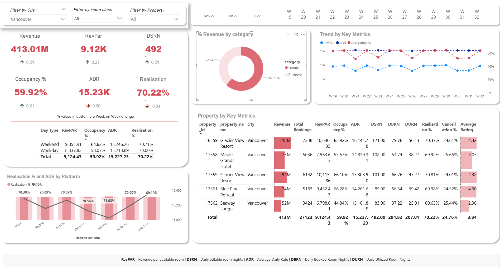

# Hotel Performance Dashboard – Power BI

## 📊 Overview

This interactive Power BI dashboard visualizes hotel performance across multiple cities and platforms. It provides KPIs like Revenue, RevPAR, Occupancy %, ADR, and Realization %, along with platform and property-level breakdowns.

Built using:
- Power BI Desktop
- DAX for KPIs and calculated fields
- Custom visuals and slicers for filtering

## 🔍 Features

- Interactive filtering by City, Room Class, and Property
- Time series trends for RevPAR, ADR, and Occupancy
- Realization % comparison across booking platforms
- Property-level KPIs with conditional formatting
- Export-ready for PDF reports

## 📁 Files

- `hotel_dashboard.pbix`: The complete dashboard file
- `dashboard_screenshot.png`: Preview image

## 🧠 Why I Built This

To explore key hospitality metrics, practice advanced DAX, and build an end-to-end data visualization solution as part of my data analytics portfolio.

## 📥 How to Use

1. Download the `.pbix` file
2. Open it using [Power BI Desktop](https://powerbi.microsoft.com/desktop/)
3. Explore the filters, charts, and visuals interactively

---

